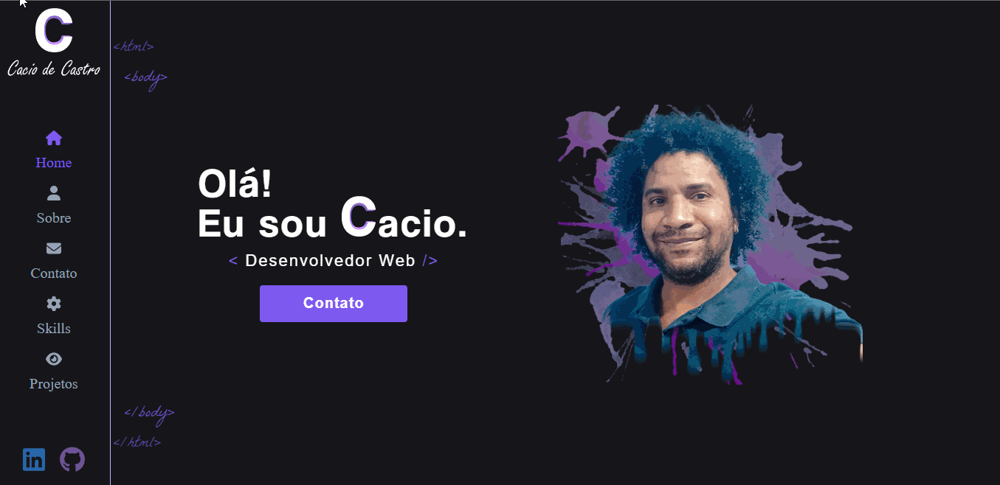

<div align="center" id="top"> 
  

&#xa0;

<a href="https://www.caciodev.com/"> ✈️ Visite 🚀</a></div>

<h1 align="center">Cacio Portifolio</h1>

<p align="center">
  

  

  


   
</p>

<!-- Status -->

<!-- <h4 align="center">
	🚧  Cacio Portifolio 🚀 Em construção...  🚧
</h4>

<hr> -->

<p align="center">
  <a href="#dart-sobre">Sobre</a> &#xa0; | &#xa0; 
  <a href="#sparkles-funcionalidades">Funcionalidades</a> &#xa0; | &#xa0;
  <a href="#rocket-tecnologias">Tecnologias</a> &#xa0; | &#xa0;
  <a href="#white_check_mark-pré-requisitos">Pré requisitos</a> &#xa0; | &#xa0;
  <a href="#checkered_flag-começando">Começando</a> &#xa0; | &#xa0;
  <a href="#memo-licença">Licença</a> &#xa0; | &#xa0;
  <a href="https://github.com/kacyos" target="_blank">Autor</a>
</p>

<br>

## 🎯 Sobre

Portifólio pessoal criado utilizando React, utilizando o serviço EmailJs para envio de emails e futuramente terá integração com o serviço de CMS do Prismic para listagem dos projetos.

## ✨ Funcionalidades

✔️ Envio de email com EmailJs;

## 🚀 Tecnologias

As seguintes ferramentas foram usadas na construção do projeto:

- [React](https://pt-br.reactjs.org/)
- [TypeScript](https://sass-lang.com/)
- [SCSS]()
- [Framer Motion](https://www.framer.com/motion/)
- [React Router DOM](https://v5.reactrouter.com/web/guides/quick-start)
- [Animate.css](https://animate.style/)
- [React-toastify](https://fkhadra.github.io/react-toastify/introduction/)
- [EmailJs](https://www.emailjs.com/)

## ✅ Pré requisitos

Antes de começar 🏁, você precisa ter o [Git](https://git-scm.com) e o [Node](https://nodejs.org/en/) instalados em sua maquina.

## 🏁 Começando

```bash
# Clone este repositório
$ git clone https://github.com/kacyos/cacio-portifolio

# Entre na pasta
$ cd cacio-portifolio

# Instale as dependências
$ yarn

# Para iniciar o projeto
$ yarn start

# O app vai inicializar em <http://localhost:3000>
```

## 📝 Licença

Este projeto está sob licença MIT. Veja o arquivo [LICENSE](LICENSE.md) para mais detalhes.

Feito com 💖 por <a href="https://github.com/kacyos" target="_blank">Cacio de Castro</a>

&#xa0;

<a href="#top">Voltar para o topo</a>
